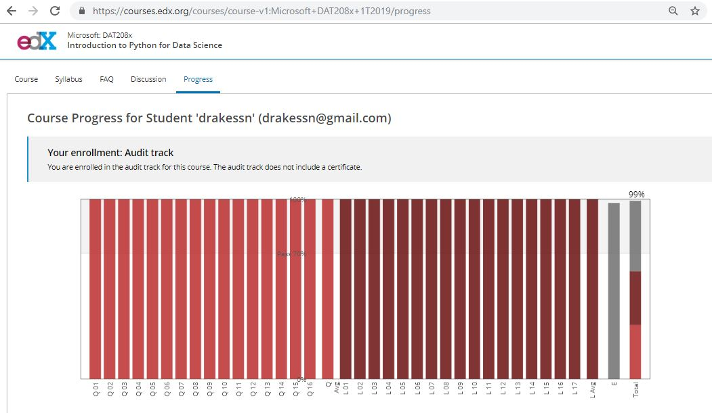

# Month 1 - Data Analysis

## Week 1 - Learn Python
- EdX https://www.edx.org/course/introduction-python-data-science-2

- Siraj Raval https://www.youtube.com/watch?v=T5pRlIbr6gg&list=PL2-dafEMk2A6QKz1mrk1uIGfHkC1zZ6UU 

## Week 2 - Statistics & Probability
- KhanAcademy https://www.khanacademy.org/math/statistics-probability

## Week 3 Data Pre-processing, Data Visualization, Exploratory Data Analysis
- EdX https://www.edx.org/course/introduction-to-computing-for-data-analysis

## Week 4 Kaggle Project #1
- Try your best at a competition of your choice from [Kaggle](https://www.kaggle.com/competitions).
- Use [Kaggle Learn](https://www.kaggle.com/learn/overview) as a helpful guide

